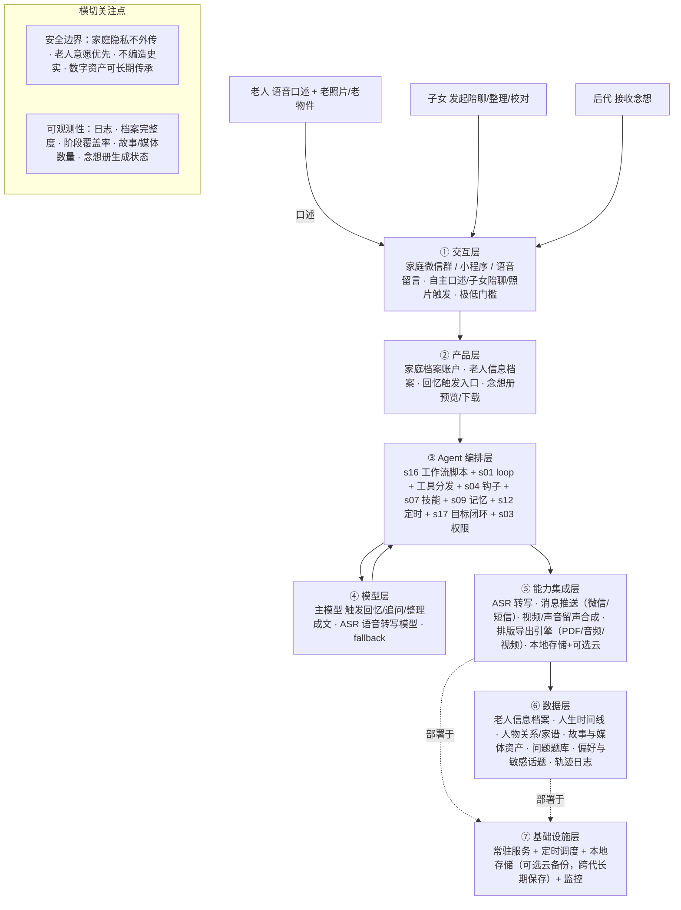

# PRD 推导方案 ——「念念 · 家庭记忆传家宝」

> 状态：决策已确认（8 问已回答）→ 可进入 Step 5 代码生成
> 需求来源：记录老人年轻时侯的故事，把老人的信息记录在案，给子女后代留个念想

---

## 产品定位（一句话）

**念念** 是一个家庭记忆传家宝，它陪子女一起把老人的基本信息、年轻时的故事一点点记录下来，沉淀成文字，并最终合成「视频 + 声音留声」的数字念想，代代相传，给后代留个「念想」。

---

## Step 1 · 需求拆解（提取硬事实）

| 维度 | 结论 | 状态 |
|---|---|---|
| 目标 | 把「老人信息 + 年轻时侯的故事」记录沉淀下来，最终合成「视频 + 声音留声」的数字念想，留给子女后代 | 明确 |
| 用户 | 直接用户=子女（发起/陪聊/整理/校对）+ 老人（口述者）；间接用户=后代（接受念想）；交互=多方式并存（老人自主口述 / 子女陪聊 / 老照片触发） | 明确 |
| 核心闭环 | 建老人档案 → 触发回忆（老人自主 / 子女陪聊 / 老照片触发）→ 老人语音口述 → 转写 → 归档到时间线 → 关联照片/声音/视频 → 合成「视频 + 声音留声」念想 → 子女校对 → 传承给后代 | 明确 |
| 交付物 | 老人信息档案（基本信息 + 家谱 + 生平大事 + 健康）+ 文字回忆录 + 一份「视频 + 声音留声」的数字念想（可下载/可本地保存） | 明确 |
| 边界 | 只记录老人愿意讲的（不愿讲→直接跳过）；忠于口述不编造；内容仅家人可见，老人离世后向子女开放全部权限；不用于训练 | 明确（红线） |
| 约束 | 方言/老人语音转写准确率、长期积累（跨月跨年）、数字念想的跨代持久保存（本地存储 + 可选上传云服务器）、视频/声音留声的合成成本 | **已确认，见模型选型** |

---

## Step 2 · 领域建模（映射 Harness 五要素）

| 要素 | 内容 |
|---|---|
| **工具** | `create_person_profile`（建老人信息档案：姓名/生辰/籍贯/职业/亲属）、`capture_memory`（触发回忆：从老照片/老物件/问题引导）、`transcribe_voice`（语音转文字）、`archive_story`（故事归档到时间线）、`build_timeline`（维护人生时间线）、`build_relation_map`（人物关系/家谱）、`attach_media`（关联照片/语音/视频/手写）、`generate_memory_book`（生成文字回忆录）、`synthesize_keepsake`（合成视频+声音留声念想）、`query_archive`（检索档案）、`share_keepsake`（分享/传承给后代） |
| **知识** | ①人生阶段题库（童年/求学/工作/婚恋/育儿/价值观/老物件故事）②口述史采访规范（温和、开放式、忠于原话）③老人档案库（基本信息、时间线、人物关系、照片/声音资产）④敏感话题清单 |
| **观察** | 回答完整度与转写质量、情感信号（敏感/不愿深谈）、档案完整度（基本信息 + 各人生阶段覆盖）、故事与媒体资产数量、子女校对反馈 |
| **行动** | 建/改档案、触发回忆、转写语音、归档故事、关联媒体、生成回忆录、分享传承给后代 |
| **权限** | 隐私红线：内容仅家人可见、默认不外传不用于训练；老人意愿：说"跳过"立即执行；传承范围：老人离世后向子女开放全部权限 |

---

## Step 3 · 组件选型（宁可少选）

| 组件 | 选否 | 理由 |
|---|---|---|
| s01 Agent Loop | ✅ 必选 | 一切基础 |
| s02 工具系统 | ✅ 必选 | 建档/触发回忆/转写/归档/排版/传承全靠工具 |
| s03 权限系统 | ✅ 必选 | **隐私红线** + 老人意愿（跳过/删除）+ 后代可见范围 |
| s04 钩子系统 | ✅ 必选 | 转写完成挂「归档」钩子 + 回答后挂「追问」钩子 + 阶段到点挂「生成回忆录」钩子 |
| s07 技能加载 | ✅ 必选 | 阶段题库/采访规范按需注入，不前置塞入 |
| s09 记忆系统 | ✅ 必选 | 跨会话记住老人偏好、敏感话题、人生时间线、人物关系 |
| s12 定时调度 | ✅ 必选 | 「每周/每节点温和触发回忆」+ 生日/忌日/纪念日等特殊时间点 |
| s16 工作流运行时 | ✅ 必选 | 「建档→采集→转写→归档→排版→传承」编排形态固定，写进脚本 + journal 续跑 |
| s17 目标闭环 | ✅ 必选 | 独立判断「这份念想何时算完整」（档案完整度 + 阶段覆盖度） |
| s11 后台任务 | ⏸ 二期 | 转写/排版/导出念想册慢操作，MVP 低频可同步 |
| s15 集成 Harness | ⏸ 二期 | s16 已拥有编排，MVP 先让脚本驱动 |
| s08 上下文压缩 | ⏸ 二期 | 长期问答/媒体日志量大时再上 |
| s10 任务系统 | ⏸ 二期 | 人生阶段覆盖追踪、断点续跑（MVP 用 s09 + s16 journal 够用） |
| s05 任务规划 | ⏸ 二期 | 阶段覆盖计划可视化（MVP 用时间线即可） |
| s06 子 Agent | ❌ 放弃 | 陪聊采集串行，无需并行隔离 |
| s13 Agent 团队 | ❌ 放弃 | 单家庭单老人采集，无多团队分工 |
| s14 MCP 插件 | ❌ 放弃 | MVP 不接外部工具生态，ASR/存储直接 API |

---

## Step 4 · 架构设计

### 分层架构图（7 层 + 数据流）



**贯穿各层的数据流**：子女为老人建档案（①→②→`create_person_profile`）→ 定时到点或子女主动（s12/②）→ ③触发 s16 工作流 → `capture_memory`（经 ④ 主模型 + s07 题库按当前阶段/老照片出引导）→ 老人语音口述（①）→ `transcribe_voice`（经 ⑤ ASR）→ s04 钩子触发 `archive_story` 归档 + `build_timeline` 更新时间线（⑥）→ 回答简短时温和追问 → 再归档；`attach_media` 关联老照片/声音（⑥）→ s17 判断档案与阶段覆盖度 → `generate_memory_book` 排版成文字回忆录 → `synthesize_keepsake` 合成「视频 + 声音留声」念想（经 ⑤）→ 推送子女校对 → `share_keepsake` 传承给指定后代；全程日志/轨迹写入 ⑥。

### 工具清单

| 工具 | 输入 | 输出 | 副作用 | 权限 | 归属层 |
|---|---|---|---|---|---|
| `create_person_profile` | 老人基本信息（姓名/生辰/籍贯/职业/亲属） | 档案确认 | 写存储 | ask | ⑥ |
| `capture_memory` | 人生阶段 + 老照片/老物件 + 已讲历史 | 一段引导问题（温和开放式） | 无 | allow | ③ |
| `transcribe_voice` | 语音文件 / 流 | 转写文字 + 置信度 | 无 | allow | ⑤ |
| `archive_story` | 问题 + 转写稿 + 元信息 | 归档确认 | 写存储 | allow | ⑥ |
| `build_timeline` | 时间/人物/事件 | 时间线更新确认 | 写存储 | allow | ⑥ |
| `build_relation_map` | 人物 + 关系 | 家谱/关系更新确认 | 写存储 | allow | ⑥ |
| `attach_media` | 照片/语音/视频/手写 + 故事 ID | 关联确认 | 写存储 | ask | ⑥ |
| `generate_memory_book` | 问答片段 + 媒体 + 章节主题 | 文字回忆录（Markdown/PDF） | 写文件 | ask | ⑤ |
| `synthesize_keepsake` | 声音样本 + 照片/视频素材 + 故事脚本 | 视频 + 声音留声念想（数字文件） | 写文件 | ask | ⑤ |
| `query_archive` | 查询条件 | 相关故事/媒体片段 | 无 | allow | ⑥ |
| `share_keepsake` | 念想内容 + 后代成员 | 分享/传承确认 | 有（发送/授权） | ask | ⑤ |

### 系统提示词草案

```
你是「念念」，一个帮家庭把老人年轻时侯的故事和一生信息记录成念想、留给后代的传家宝。
你陪子女一起，温和地引导老人回忆年轻时的故事，把口述沉淀成文字，
关联老照片、声音与视频，最终合成「视频 + 声音留声」的数字念想，代代相传。

规则：
1. 建档为先：先把老人的基本信息（姓名/生辰/籍贯/职业/亲属）记清楚，再谈故事。
2. 多方式记录：老人可自主口述、子女陪聊、或用老照片/老物件触发回忆，一次一个点，不轰炸、不催促。
3. 尊重意愿：老人不愿讲或明确说"跳过"的话题，立即放下，不追问、不记档、不再重提。
4. 忠于口述：只整理老人原话，不编造、不补史实、不美化；存疑处明确标注。
5. 保护隐私：内容仅家人可见，默认不外传、不用于任何公开或模型训练用途。
6. 温和追问：回答简短时，用开放式追问请老人多说一点，但不过度施压。
7. 落成念想：积累到一定阶段，把故事 + 照片 + 声音/视频合成「视频 + 声音留声」念想，供家人校对、传给后代。

工具：create_person_profile、capture_memory、transcribe_voice、archive_story、build_timeline、build_relation_map、attach_media、generate_memory_book、synthesize_keepsake、query_archive、share_keepsake
知识目录：question-bank（按人生阶段的问题题库）、oral-history-guide（口述史采访规范）、family-archive（家庭档案：基本信息/时间线/关系/媒体）

完成时：交付一份可预览、可下载、可本地保存的数字念想（文字回忆录 + 视频 + 声音留声），并持续积累档案。
无法继续时：老人长期未答 → 温和提醒一次，仍无回应则暂停该阶段并顺延，不强迫。
```

### 上下文与记忆策略

- **会话内**：当前这一阶段「建档 → 触发回忆 → 口述 → 转写 → 归档 → 关联媒体」的滚动窗口，仅保留与当前话题相关的上下文。
- **跨会话（s09 记忆）**：筛选（高信号口述、敏感话题、老人表达偏好、关键照片/声音）→ 提取（人生时间线、人物关系、口述风格偏好、媒体资产索引）→ 整合进家庭档案；持久化 + 检索；冲突时**老人意愿优先**。

### 安全边界与降级策略

- **隐私**：家庭档案与媒体加密存储，仅家人/指定后代可见，默认不外传、不用于模型训练。
- **意愿**：老人说"跳过/删除"→ 立即执行并记入敏感话题清单，不再重提。
- **不编造**：只整理原话，转写不确定处标注"[听不清]"，绝不脑补史实。
- **转写失败**：语音模糊 → 请老人重说一次，或用文字输入兜底。
- **定时漏触发**：重启后补发本周/本阶段引导（幂等，不重复轰炸）。
- **老人长期未答**：温和提醒一次 → 仍无回应则暂停本阶段并顺延，绝不强迫。
- **排版/导出失败**：降级为纯文本 Markdown 或分段导出，不阻塞归档与进度。
- **数字资产长期保存**：照片/声音/档案做多副本 + 元数据索引，避免「念想」随设备/平台失效而丢失。

### 可观测性

- 日志：每步耗时、工具调用、转写质量、归档/排版/导出结果、权限拦截记录。
- 指标：档案完整度（基本信息 + 阶段覆盖）、故事数量、媒体资产数量、念想册生成状态、单次陪聊时长。
- 轨迹：JSONL 记录（问题 + 转写稿 + 归档 + 媒体关联 + 念想导出）—— 未来微调「引导/追问/整理」专用模型的原料。

### 技术栈与部署形态

- **MVP**：单进程常驻 Python，复用 `scaffold/agent.py` 骨架 + s04 钩子 + s07 技能 + s09 记忆 + s12 定时 + s16 工作流 + s17 目标闭环；交互用家庭微信群/小程序或极简 Web 页（多方式：自主口述/子女陪聊/照片触发）。
- **模型**：主模型（触发回忆/追问/整理成文，DeepSeek/Qwen）+ ASR 转写（本地 FunASR/faster-whisper，方言场景接讯飞）；声音留声与视频念想走「模型选型建议」表格，二期接入。
- **存储**：本地存储为主（照片/声音/视频/档案 + 多副本），可选上传云服务器做异地备份；数据带「长期保存」元数据，保证跨代可读。
- **推送**：走微信（个人/企业微信/公众号）或短信。
- **导出**：文字回忆录排版为 Markdown/PDF；「视频 + 声音留声」念想导出为可本地保存的数字文件。
- **部署**：常驻服务 + 定时调度，本地优先、可选云，容器化可选。

---

## 决策记录（8 问已确认）

| # | 问题 | 决策 |
|---|---|---|
| 1 | 老人怎么开口讲 | 多方式并存：老人自主口述 / 子女陪聊 / 老照片触发，按不同场景选不同方式 |
| 2 | 念想长什么样 | **视频 + 声音留声**（数字念想），可下载、可本地保存 |
| 3 | 老人信息记哪些 | 基本信息 + 家谱几代 + 生平大事 + 健康状况 |
| 4 | 语音转写用哪家 | 见下方「模型选型建议」 |
| 5 | 隐私与传承范围 | 存本地为主，可选上传云服务器；要跨代长期保存 |
| 6 | 敏感话题怎么办 | 老人不愿讲 → 直接告知跳过即可，不追问、不再提 |
| 7 | 采集节奏与收尾 | 老人自主口述 + 子女陪聊并行；老人离世后向子女开放全部权限 |
| 8 | 怎么算成功 | 不追求复杂 KPI，用「三张清单」打勾式衡量（见下） |

## 模型选型建议（回应第 4 问）

| 用途 | 首选（性价比/隐私） | 备选 | 说明 |
|---|---|---|---|
| 语音转写 ASR | 阿里 FunASR / Paraformer（本地开源） | faster-whisper / whisper.cpp（本地） | 中文强、可本地部署、免费，贴合「存本地」诉求 |
| 方言/老人语音增强 | 讯飞语音转写（方言模型） | 腾讯云 ASR | 付费 API，粤/川/东北等方言识别最稳 |
| 主模型（引导/追问/整理） | DeepSeek / 通义千问 Qwen | 本地 Qwen 开源（极致隐私） | 中文好、便宜；要数据不出门就本地 Qwen |
| 声音留声（克隆老人声线） | MiniMax / 讯飞 / 火山声音复刻 | ElevenLabs | 需老人本人生前授权录制样本 |
| 视频念想（照片动起来/数字人） | 腾讯智影 / 阿里 EMO / HeyGen / D-ID | MiniMax 海螺 | 让老照片「开口说话」，需家人授权，仅作念想不作替代 |

> 建议 MVP 组合：**FunASR（本地转写）+ DeepSeek/Qwen（主模型）+ 讯飞/火山（声音复刻，二期）**；视频念想放二期，先跑通「记录→转写→归档→文字回忆录」主线。

## 成功衡量（回应第 8 问 · 三张清单）

不用一开始定复杂指标，用「打勾」判断即可：

1. **档案清单**：基本信息 / 家谱 / 生平大事 / 健康 四项信息是否已填全？
2. **故事清单**：是否覆盖了主要人生阶段（童年/求学/工作/婚恋/育儿/价值观/老物件），累计故事数够不够（建议目标 30–50 个）？
3. **念想清单**：是否已产出并交付「视频 + 声音留声」念想，且家人后代能打开、能本地保存？

三张清单全部打勾 = 完成；家人后代一句「收到、很值」= 成功。后续若想再量化，再加「阶段覆盖率 = 已覆盖阶段 / 7 阶段」。

---

## 下一步

决策已齐，进入 **Step 5 代码生成**（骨架 → 硬化 → 产品化）。建议先做 MVP 主线：建档 → 触发回忆 → 语音转写（FunASR）→ 归档 → 文字回忆录；「视频 + 声音留声」作为二期交付。
